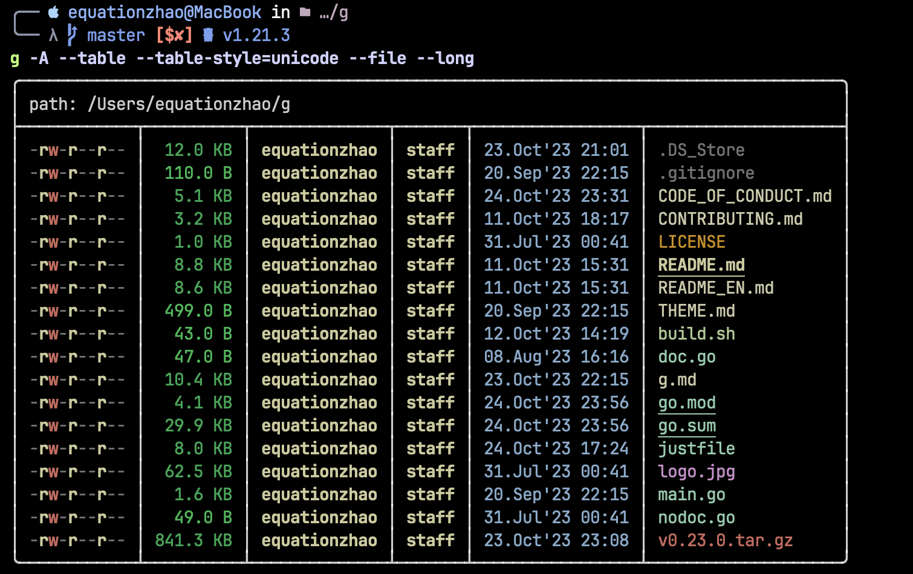

# g

> 一个强大的 ls 工具

<p align="center">
<a href="README_EN.md">View this document in English</a>
</p>


g 是一个 ls 替代品，拥有下面一些功能：

1. 显示带有类型特定图标和颜色的条目，并且易于更改
2. 有丰富的输出格式  ( grid/across/byline/zero/comma/table/json/markdown/tree )
3. 支持显示 git status 
4. 丰富且可自定义的排序选项
5. 跨平台 ( Linux/Windows/MacOS )
6. 支持使用[`fzf`](https://github.com/junegunn/fzf) 算法，像 [`zoxide`](https://github.com/ajeetdsouza/zoxide) 一样模糊匹配路径 

## 截图



## 安装

### 源码安装

要求 go version >= 1.21

```bash
go install -ldflags="-s -w"  github.com/Equationzhao/g@latest
```

或者 clone 这个仓库 (nightly build)

```bash
git clone github.com/Equationzhao/g
cd g
go build -ldflags="-s -w" # use -s -w to shrink size
# then add the executable file to your `PATH`
```

### 通过包管理器

#### Arch Linux(AUR)

```bash
yay -S g-ls
```

#### homebrew-tap

```bash
brew tap equationzhao/core git@github.com:Equationzhao/homebrew-g.git
```

```bash
brew install g-ls
```

#### Windows Scoop:

```powershell
scoop install https://raw.githubusercontent.com/Equationzhao/g/master/scoop/g.json
```

```powershell
# upgrade
scoop uninstall g # uninstall first
scoop install https://raw.githubusercontent.com/Equationzhao/g/master/scoop/g.json
```
#### Winget

TODO, see [issue](https://github.com/Equationzhao/g/issues/119)

### 二进制文件

#### curl

```sh
bash -c "$(curl -fsSLk https://raw.githubusercontent.com/Equationzhao/g/master/script/install.sh)"
```

#### deb

从 [release](https://github.com/Equationzhao/g/releases) 页下载对应deb文件后安装

```bash
sudo dpkg -i g_$version_$arch.deb
```

#### tar.gz/zip
从 [release page](https://github.com/Equationzhao/g/releases) 下载对应平台的文件, 解压 gzip 并将可执行文件添加到 `PATH`

## 推荐使用的终端

macOS:
- [Iterm2](https://iterm2.com/)
- [Warp](https://www.warp.dev)

Windows:
- [Windows Terminal](https://github.com/microsoft/terminal)

cross-platform:
- [Hyper](https://hyper.is/)
- [WezTerm](https://wezfurlong.org/wezterm/index.html)

## 用法

```bash
g path(s)
```

## Shell 集成 (alias)

生成 shell 脚本(alias)

```bash
g -init bash/zsh/fish/pwsh
```

### bash

```.bash
# add the following command to .bashrc
eval "$(g --init bash)"
# then `source ~/.bashrc`
```

### zsh

```zsh
# add the following command to .zshrc
eval "$(g --init zsh)"
# then `source ~/.zshrc`
```

### fish

```fish
#  add to fish config:
g --init fish | source
#  then `source ~/.config/fish/config.fish`
```

### powershell

```powershell
# add the following line to your profile
Invoke-Expression (& { (g --init powershell | Out-String) })
```

使用 `echo $profile`命令查找配置文件路径

### nushell

```nu
# add the following to your $nu.env-path
^g --init nushell | save -f ~/.g.nu
# then add the following to your $nu.config-path
source ~/.g.nu

# if you want to replace nushell's g command with g
# add the following definition and alias to your $nu.config-path
#
# def nug [arg?] {
#     if ($arg == null) {
#         g $arg
#     } else {
#         g
#     }
# }
# alias g = ^g
```

## 更多选项

[g.md](g.md)  或查看 [主页](g.equationzhao.space)

## 自定义主题

[theme](THEME.md)

## TODO
- [x] Version sort
- [ ] Git sort
- [ ] Print security context
- [x] $OLDPWD
- [ ] Color Support for html/markdown
- [x] Support Scoop

以下是 eza 的新功能，后续计划支持
- [x] --git-repos: list each directory’s Git status, if tracked
- [x] --git-repos-no-status: list whether a directory is a Git repository, but not its status (faster)

## CONTRIBUTING

若您对该项目的发展感兴趣,请查看 [CONTRIBUTING](./CONTRIBUTING.md)

## 其他选择

本项目受到以下项目的启发，你也许想试试

- [exa](https://github.com/ogham/exa) 或者 [eza](https://github.com/eza-community/eza)
- [lsd](https://github.com/lsd-rs/lsd)
- [ls-go](https://github.com/acarl005/ls-go)

## Star History

[](https://star-history.com/#Equationzhao/g&Date)